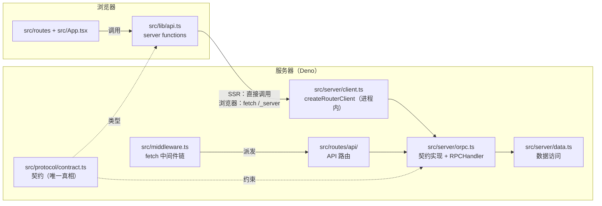

# 架构

- 版本：v1.0（2026-09-14）
- 状态：template 基线
- 相关文档：[development.md](./development.md)（开发规范）·
  [../AGENTS.md](../AGENTS.md)（Agent 入口）·
  [../skills/README.md](../skills/README.md)（技能模块）

## 0. 定位与技术栈

这是一个 turnkey SSR 全栈模板：Deno 提供运行时与依赖管理，Vite 8 +
`@solidjs/vite-plugin` 生成并托管 SSR 入口， Solid 2.0 负责 UI
与反应式数据，oRPC + Zod 负责类型化契约，Tailwind 4 负责样式。

| 层                | 选型                                        | 版本（锁定于 `deno.lock`） |
| ----------------- | ------------------------------------------- | -------------------------- |
| 运行时 / 包管理   | Deno（`deno.json` imports + `deno.lock`）   | Deno 2.9+                  |
| 构建 / 开发服务器 | Vite + `@solidjs/vite-plugin`（start 模式） | Vite 8                     |
| UI / 反应式       | Solid 2.0（`solid-js` + `@solidjs/web`）    | 2.0 RC                     |
| 路由              | `@solidjs/router` 2 + `filesystem-routing`  | 2.0 next / 0.2.1           |
| 契约 / RPC        | oRPC 2（contract-first）+ Zod 4             | 2.0 beta / 4.x             |
| 样式              | Tailwind CSS 4（CSS-first）                 | 4.x                        |
| Head              | `@solidjs/meta`                             | 1.x next                   |

## 1. 分层与职责

| 目录/文件                   | 职责                                                                                      | 是否进客户端包                                |
| --------------------------- | ----------------------------------------------------------------------------------------- | --------------------------------------------- |
| `src/protocol/contract.ts`  | 契约：procedure 的 input/output schema，类型由 `z.output` 推导                            | 类型与 schema 是纯数据；UI 不直接 import 实现 |
| `src/protocol/transport.ts` | 传输路径常量（`rpcPath`），客户端与路由共享                                               | 是                                            |
| `src/server/orpc.ts`        | `implement(contract)` 的实现 + `RPCHandler`（HTTP 面）                                    | 否                                            |
| `src/server/client.ts`      | 服务端访问实现的唯一缝：默认 `createRouterClient`（进程内直调）；换远端时替换为 `RPCLink` | 否                                            |
| `src/server/data.ts`        | 数据访问（示例为内存数据）；换数据库只改这里                                              | 否                                            |
| `src/lib/api.ts`            | 应用数据层：`"use server"` 函数 + 路由 `query()`；UI 只依赖它                             | 只有编译后的 fetch 桩                         |
| `src/routes/**`             | 文件路由：默认导出是页面；`GET/POST/...` 导出是 API 路由                                  | 页面仅按需代码分割加载；handler-only 模块不进 |
| `src/middleware.ts`         | 前置每个请求的 fetch 中间件链（API 路由派发）                                             | 否                                            |
| `src/App.tsx`               | 应用根：`Router` + 全局 `<Loading>` / `<Errored>` 边界                                    | 是                                            |
| `src/Document.tsx`          | 文档壳（新的 index.html）：`<html>` / `<head>` / `<HydrationScript>`                      | 服务端渲染                                    |
| `src/router.ts`             | 路由实例：`virtual:file-routes` → `createRouter`                                          | 是                                            |
| `start.ts`                  | 统一宿主：dev 程序内起 Vite；生产托管 `dist/client` + `handleRequest`（浏览器与桌面通用） | 运行时文件                                    |

## 2. 一次请求的旅程

**页面 SSR**：`start.ts` 先尝试 `dist/client`
静态资源；未命中则把请求交给构建产物 `dist/server/server.js` 的
`handleRequest(request, { event: { nativeEvent: info } })`。中间件链
（`src/middleware.ts`）先派发 API 路由；未匹配则进入页面渲染：路由 `preload`
中的 `query()` 在服务端直接调用 server function → `createRouterClient` →
契约实现，数据随流式 HTML 一起下发，客户端 hydration 接管。

**浏览器内导航**：点击 `<a href="/posts">` → 路由懒加载页面模块 →
`route.preload` 触发 `query()` → server function 被编译器替换成对 `/_server`
的类型化 fetch → 响应补丁当前页面，无需整页刷新。

**外部调用（HTTP）**：`POST /api/rpc/<procedure>`，JSON 信封 `{"json": <input>}`
→ `src/routes/api/rpc/[...rest].ts` 的 `GET`/`POST` handler →
`RPCHandler.handle(request, { prefix })` → 命中 procedure 执行，响应
`{"json": <output>}`；未命中返回 404。

**Server function 与 API 路由的选择**：

- 应用内 UI 读取/写入 → server functions（`src/lib/api.ts`）。SSR
  零网络开销，浏览器端类型化 fetch。
- 外部客户端（CLI、其它服务、第三方）→ oRPC HTTP
  端点（`/api/rpc`），契约同一份。
- 非 oRPC 的普通 HTTP（webhook、文件、sitemap）→ `src/routes/api/**` 的
  `GET`/`POST` 导出。

## 3. 边界与纪律

1. **契约先行**：任何 API 变更先改 `src/protocol/contract.ts`；实现、server
   function、UI 因类型报错自动跟上。
2. **UI 不依赖实现**：前端只 import `src/lib/api.ts`；不 import
   `src/server/*`、不创建浏览器端 oRPC client。
3. **server-only 边界**：`src/server/*` 与 `src/middleware.ts` 只会进入服务端
   bundle；`"use server"` 函数体及其 import 也不会进入客户端包。 handler-only
   路由模块（无默认导出）同理。
4. **数据访问收口**：契约实现只做校验后的编排，数据访问放 `src/server/*`（示例
   `data.ts`），便于替换与测试。
5. **依赖唯一来源**：只用 `deno.json` 的 `imports`
   映射声明依赖，`deno add npm:...` 变更后提交 `deno.lock`。
6. **渲染模式**：`ssr: true`（流式 SSR）+ `serverFunctions`；`Loading`
   边界在壳层，页面数据在 `preload` 里起跑。

## 4. 构建与生产宿主

- `deno task dev`：`start.ts --dev` 程序内启动 Vite（HMR + 流式 SSR + `/_server`
  端点；dev 中间件即生产 handler）。
- `deno task build`：产出 `dist/client`（静态资源 + manifest）与
  `dist/server/server.js`（`handleRequest`）。
- `deno task start`：`start.ts` 托管以上两者——静态资源命中直接返回，其余交给
  `handleRequest`。
- `deno task dev:desktop` / `deno desktop start.ts`：同一入口跑桌面容器（Vite
  dev server / 生产产物），运行时通过 `DENO_SERVE_ADDRESS` 指定端口（见
  `skills/deno-desktop/`）。
- `deno task serve`：`vite preview`，不写宿主也能本地验收生产产物。
- `handleRequest` 是平台无关的 `Request -> Response`；迁移到 Deno Deploy /
  Workers / `deno serve` 时可直接替换 `start.ts` 这一层适配。

## 5. 贯穿示例：`/posts`

`/posts` 是模板的全链路示例——新增一个只读数据页需要动到的每一层：

1. `src/protocol/contract.ts`：`post.list`（input `limit`，output
   `Post[]`；`Post` 由 schema 推导）。
2. `src/server/data.ts`：`listPosts(limit)`（换数据库只改这里）。
3. `src/server/orpc.ts`：`os.post.list.handler(({ input }) => listPosts(input.limit))`。
4. `src/lib/api.ts`：`getPosts = query(async () => { "use server"; return client.post.list(...) }, "posts")`。
5. `src/routes/posts.tsx`：`route.preload` 预热 query，组件用 `createMemo`
   读取并把渲染挂到全局 `<Loading>` 下。

写入路径使用 `action()` 包装 `"use server"` 函数（见
[development.md](./development.md#4-router-2-数据-api)）； router 会在 action
落定后按 key 重取受影响的 query。
