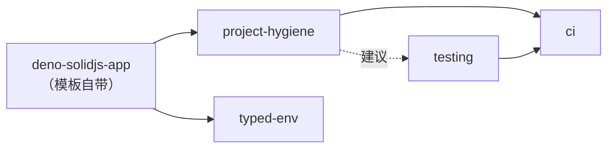

# Skills —— 可选能力模块

这里的每个目录是一个独立技能（`<name>/SKILL.md`），按"任务类型"拆分。
模板本体只带导航技能与主技能；其余能力由 Agent
按需加载、按需启用，**不要一次性全装**。

## 技能清单

| 技能                                              | 一句话                                                    | 何时加载                   | 前置                              |
| ------------------------------------------------- | --------------------------------------------------------- | -------------------------- | --------------------------------- |
| [`skills-index`](./skills-index/SKILL.md)         | 导航：意图 → 技能/文档路由表 + 能力装载检测               | 不确定该读什么时           | 无                                |
| [`deno-solidjs-app`](./deno-solidjs-app/SKILL.md) | 项目使用方式 + 开发指导（常驻，无需启用）                 | 在本项目做任何开发/调试    | 无                                |
| [`project-hygiene`](./project-hygiene/SKILL.md)   | 格式化/lint 门禁 + `deno task verify` 一键闭环            | 需要统一格式、加验证命令时 | 无                                |
| [`testing`](./testing/SKILL.md)                   | Vitest 双 project（client jsdom / server node）+ 示例测试 | 需要测试基建、写测试时     | 建议先装 project-hygiene          |
| [`typed-env`](./typed-env/SKILL.md)               | 类型化环境变量（`env.ts` + `virtual:env/*`）              | 需要环境变量校验/类型时    | 无                                |
| [`deno-desktop`](./deno-desktop/SKILL.md)         | 用 `deno desktop` 打包桌面应用（Deno.serve 入口 + 配置）  | 需要桌面分发形态时         | 无（需 Deno ≥ 2.9）               |
| [`ci`](./ci/SKILL.md)                             | GitHub Actions：install + verify + test + build           | 需要 CI 时                 | 硬前置：project-hygiene + testing |

## 组合关系

`skills-index`
是导航层，不参与组合依赖：任何任务都可以先经过它定位到下面的技能。



可自由组合；`ci` 的 workflow 引用 `verify`（hygiene）与
`test`（testing）两个任务，缺一个就先装对应技能。

## Agent 应用协议

1. **先读技能**：加载对应 `SKILL.md`，不要凭记忆猜版本 API。
2. **检查哨兵**：技能内声明的 sentinel（文件/任务）已存在则跳过安装，只跑
   Verify（幂等）。
3. **按序 Apply**：只做该技能范围内的改动，不夹带其它技能的内容。
4. **跑 Verify**：失败则回滚本次改动再排查。
5. **记录能力**：Apply 成功后，在仓库根 `AGENTS.md` 的 `## Enabled capabilities`
   追加一行（例：`- testing (2026-09-14)`）。
6. **按需组合**：一个技能不代表其余技能可用；需要时单独加载。

## 如何被加载

- **本仓库（opencode）**：根目录 `opencode.json` 已注册
  `skills.paths: ["./skills"]`；重启 opencode 后按 description
  自动出现在可用技能里。
- **派生项目**：`skills/` 随模板复制；保留 `opencode.json` 即可。也可以把
  `skills.paths` 指回本模板仓库的
  `skills/`，让多个项目共享同一份技能（推荐，避免技能副本漂移）。
- **外部项目主动引用**：在目标项目的 `opencode.json` 写
  `"skills": { "paths": ["/abs/path/to/deno-solidjs-template/skills"] }`，或只复制单个技能目录。
  能力技能自包含；主技能引用本仓库 `docs/`，脱离仓库时以技能内摘要为准。
- **其它 Agent 工具**：技能是标准 `SKILL.md`
  格式，复制到该工具的技能目录即可（如 `.claude/skills/`）。

## 新增一个技能

目录结构 `skills/<kebab-name>/SKILL.md`，frontmatter：

```yaml
---
name: <kebab-name>            # 与目录名一致
description: Use when ...     # 英文，前挂触发关键词；说明做什么 + 何时用
---
```

正文固定结构：`何时使用 → 前置检查（sentinel）→ Apply 步骤（精确代码块）→ Verify 命令 → 组合注意 → 回滚`。
技能内所有依赖版本以模板 `deno.json` 为准；涉及 beta/RC
库时在技能里注明版本漂移风险。
